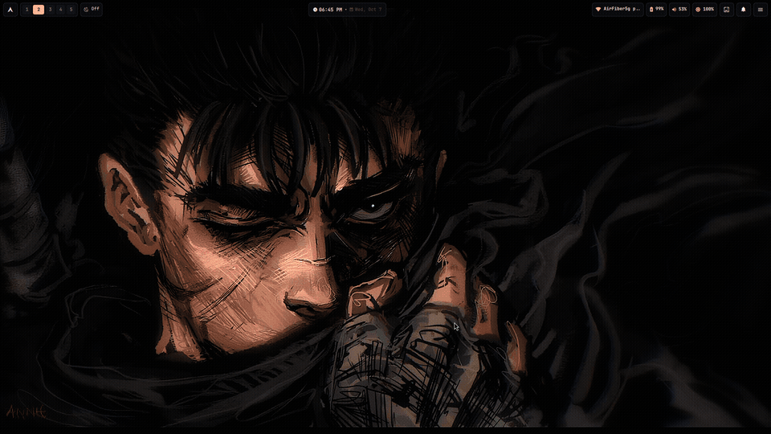
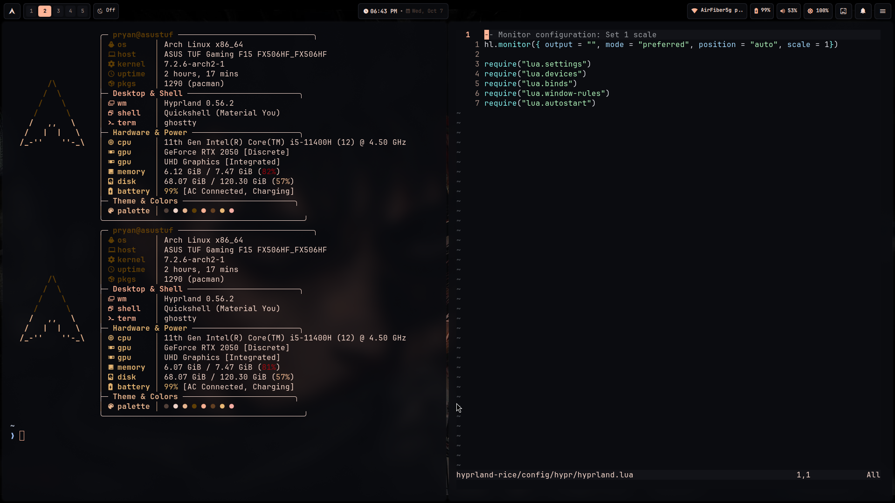
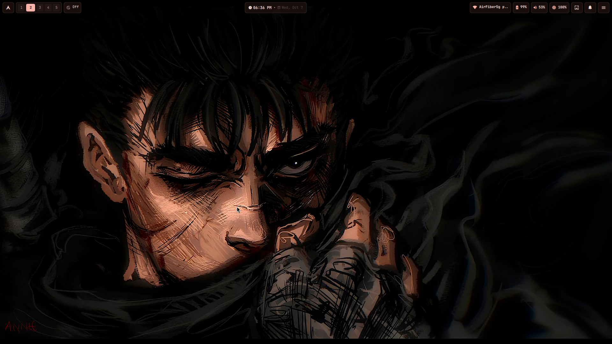
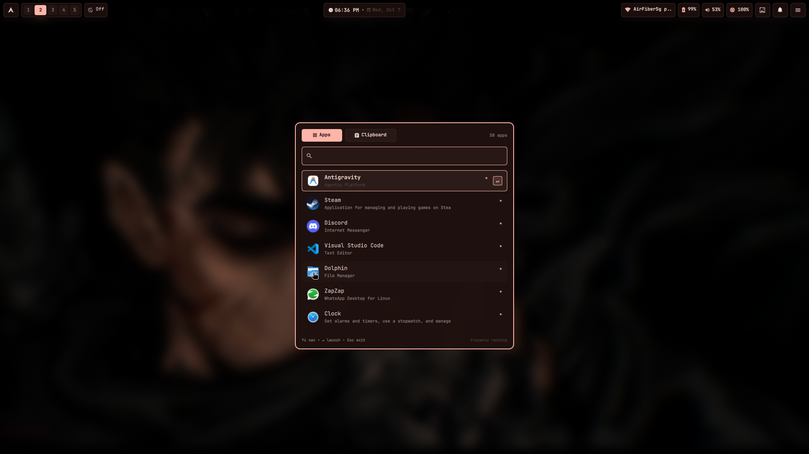
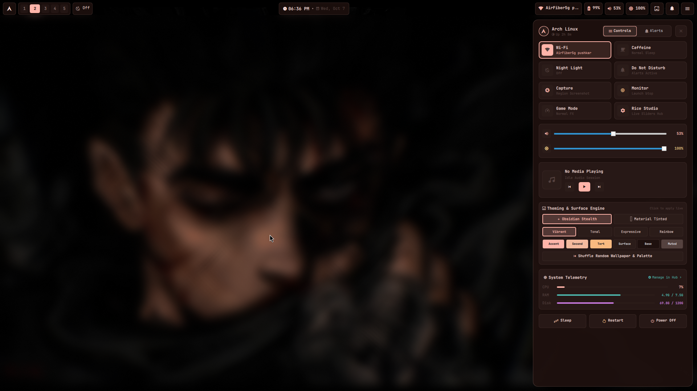
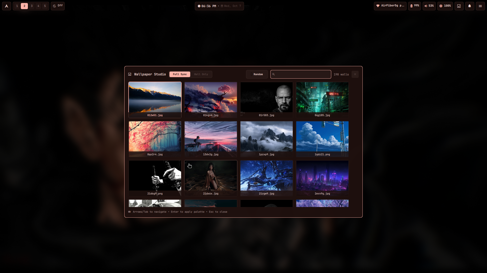
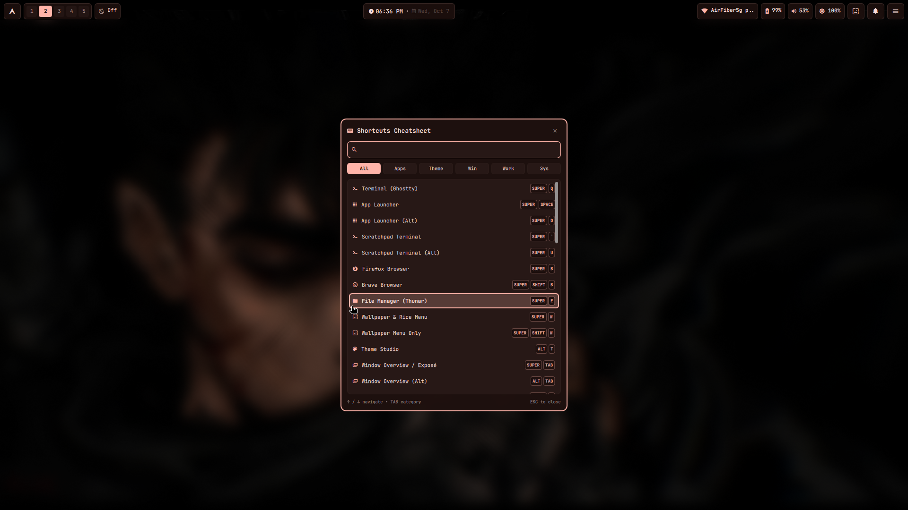

<div align="center">

# ✦ Hyprland Material You Rice ✦
### Native Hyprland Lua  •  Pure Quickshell Desktop  •  Dynamic Palette Generation

[](https://archlinux.org)
[](https://hyprland.org)
[](https://git.outfoxxed.me/outfoxxed/quickshell)
[](https://ghostty.org)
[](https://github.com/InioX/matugen)
[](LICENSE)

*A clean, GPU-accelerated Wayland desktop crafted around native Hyprland Lua, a unified Quickshell interface (replacing Waybar, Rofi, and SwayNC), and wallpaper-reactive Material You color generation.*

---

## 🎬 Showcase Preview



</div>

---

## 📸 Desktop Gallery

<div align="center">

### Tiled Workspaces & Real Applications


### Clean Minimalist Desktop


### Quickshell Spotlight App Launcher (`SUPER + SPACE`)


### Control Center & System Dashboard (`SUPER + N`)


### Wallpaper Studio & Dynamic Palette Switcher (`SUPER + W`)


### Keyboard Shortcuts Cheatsheet (`SUPER + /`)


</div>

---

## 🎨 System Specs & Details

| Component | Software / Details |
| :--- | :--- |
| **OS** | [Arch Linux](https://archlinux.org/) |
| **Compositor** | [Hyprland](https://hyprland.org/) (`0.56+` with native Lua configuration) |
| **Desktop Shell** | [Quickshell](https://git.outfoxxed.me/outfoxxed/quickshell) (Qt6 / QML native Top Bar, Dashboard, Launcher & Notifications) |
| **Color Engine** | [Matugen](https://github.com/InioX/matugen) (Extracts Material You palettes from wallpaper) |
| **Wallpaper Daemon** | [awww](https://codeberg.org/LGFae/awww) (Smooth GPU-accelerated transitions) |
| **Terminal** | [Ghostty](https://ghostty.org/) (Native blur, padding, Material You theme integration) |
| **Shell** | `zsh` + `fzf-tab` (IntelliSense completions) + `zoxide` + `fastfetch` |
| **Prompt** | [Starship](https://starship.rs/) (Minimalist Material You dark theme) |
| **Font** | `JetBrainsMono Nerd Font` |
| **File Manager** | `thunar` |
| **Blue Light Filter** | `hyprsunset` (`SUPER + ALT + N` toggle) |
| **Screenshot Tool** | `grim` + `slurp` + `wl-clipboard` |
| **Screen Recording**| `wf-recorder` (`SUPER + SHIFT + R`) |

---

## ✨ Features

- **🚀 Native Hyprland Lua**: Written entirely in Lua (`hyprland.lua`, `lua/*.lua`), eliminating legacy config quirks and allowing modular code organization.
- **💎 Pure Quickshell Desktop Environment**:
  - **Unified Architecture**: Replaces Waybar, Rofi, Dunst/SwayNC, and external wallpaper switchers with a single, ultra-fast Qt6 QML daemon.
  - **Dynamic Top Bar**: Displays animated workspace pills, active window title, system indicators, and an interactive calendar dropdown.
  - **Spotlight App Launcher**: Instant fuzzy application search with frecency scoring, icon resolution, and clipboard history (`SUPER + V`).
  - **Full Control Center**: Network/Bluetooth toggles, Night Light controls, hardware telemetry (CPU, RAM, GPU, top processes), media controls, and volume/brightness sliders.
  - **Wallpaper Picker & Theme Studio**: Visual wallpaper selector with live preview and smooth wipe transitions (`SUPER + W`), plus curated theme studio (`ALT + T`).
  - **Interactive Cheatsheet**: Searchable native keybindings guide accessible anytime via `SUPER + /`.
- **🌈 Adaptive Material You Theming**:
  - Switching wallpapers dynamically extracts tonal color palettes with Matugen.
  - Instantly updates Hyprland window border gradients, Quickshell UI accents, and Ghostty terminal color schemes on the fly.
- **⚡ Supercharged Shell**:
  - Zsh featuring `fzf-tab` for interactive floating tab completion with live previews.
  - Fast directory jumping with `zoxide`.
  - Modern CLI aliases (`eza` for `ls`, `bat` for `cat`, `fastfetch`).
- **🗂️ Turnkey OS-Grade Automation**:
  - Includes automated `install.sh` supporting both **Symlink** (for active development) and **Copy** modes, automated pre-flight hardware checks, AUR helper management, and timestamped backups.
  - Includes safe `uninstall.sh` with automatic backup restoration.

---

## ⌨️ Keybindings Cheat Sheet

| Keybinding | Action |
| :--- | :--- |
| `SUPER + SPACE` | Toggle Spotlight Application Launcher |
| `SUPER + N` | Toggle Control Center / Dashboard Side Panel |
| `SUPER + W` | Toggle Wallpaper Picker & Dynamic Theme Switcher |
| `ALT + T` | Open Curated Theme Preset Studio |
| `SUPER + /` | Open Interactive Keybindings Cheatsheet |
| `SUPER + V` | Open Clipboard History (cliphist) |
| `SUPER + Q` | Launch Ghostty Terminal |
| `SUPER + E` | Open Thunar File Manager |
| `SUPER + B` | Launch Default Web Browser |
| `SUPER + F4` | Close / Kill Active Window |
| `SUPER + T` | Toggle Window Floating |
| `SUPER + F` | Toggle Fullscreen |
| `SUPER + \`` / `SUPER + U` | **Toggle Seamless Scratchpad Floating Terminal** |
| `SUPER + S` | Toggle Magic Special Workspace |
| `SUPER + [1-9]` | Switch to Workspace 1-9 |
| `SUPER + SHIFT + [1-9]` | Move Window to Workspace 1-9 |
| `SUPER + ALT + Arrows/Vim` | Resize Active Window |
| `SUPER + ALT + N` | Cycle Blue Light / Night Light (Off → 4500K → 3500K → 2700K) |
| `Print` | Interactive Region Screenshot (copies to clipboard & saves to `~/Pictures/shots`) |
| `SUPER + SHIFT + R` | Start / Stop Region Screen Recording (`~/Videos/recordings`) |
| `SUPER + X` | Power & Session Menu |
| `SUPER + M` | Exit Hyprland Compositor |

---

## 📦 Installation

### 1. Clone the Repository
```bash
git clone https://github.com/devpryan7792/hyprland-rice.git ~/hyprland-rice
cd ~/hyprland-rice
```

### 2. Run the Turnkey Installer
```bash
chmod +x install.sh
./install.sh
```

> **Options:**
> - `./install.sh -s` — **Symlink mode**: Creates live symlinks from `~/.config` to the repo (recommended for development & personal tweaking).
> - `./install.sh -c` — **Copy mode**: Copies dotfiles to `~/.config` independently.
> - `./install.sh -y` — **Unattended mode**: Automatically answers yes to all prompts.
> - `./install.sh --no-pkg` — Skips package installation and deploys dotfiles only.

The installer will:
1. Detect Arch Linux, GPU hardware (Nvidia/AMD/Intel), and laptop battery status.
2. Check for or install an AUR helper (`yay` / `paru`).
3. Install required official and AUR packages (`hyprland`, `quickshell`, `matugen`, `awww`, `ghostty`, fonts, audio, portals).
4. Safely back up existing configurations to `~/.config/hyprland-rice-backup-<timestamp>`.
5. Deploy dotfiles and scripts with proper executable permissions.
6. Clone essential Zsh plugins (`fzf-tab`, `zsh-autosuggestions`, `zsh-syntax-highlighting`).
7. Deploy curated wallpapers and generate the initial Material You color palette.

---

## 🔄 Uninstallation & Backup Restore

To cleanly remove the rice configurations or restore your previous desktop setup:
```bash
cd ~/hyprland-rice
./uninstall.sh
```
If an installation backup exists, `uninstall.sh` will prompt to automatically restore your original dotfiles.

---

## 📜 License

Distributed under the MIT License. See `LICENSE` for more information.
